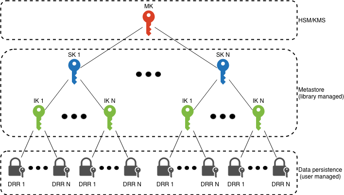
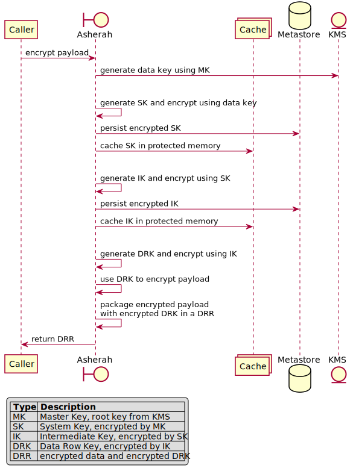
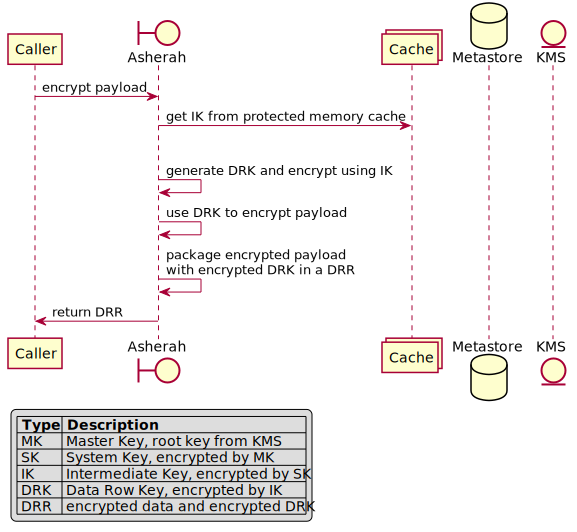

# Design and Architecture

   * [Definitions](#definitions)
       * [Common Encryption Terminology](#common-encryption-terminology)
       * [SDK Terminology](#sdk-terminology)
   * [Data Structures and Storage](#data-structures-and-storage)
       * [Envelope Key Record Structure](#envelope-key-record-structure)
           * [Intermediate Key and System Key](#intermediate-key-and-system-key)
           * [Data Row Record](#data-row-record)
       * [Key Hierarchy and Storage](#key-hierarchy-and-storage)
   * [High Level Library Flows](#high-level-library-flows)

## Definitions

### Common Encryption Terminology

The following common encryption terms will help establish the roles of the internals in the SDK.

* **Data Encryption Key (DEK)**
    * A key that is used to encrypt data
* **Key Encryption Key (KEK)**
    * A key that is used to encrypt another key (as opposed to data)
* **Envelope Encryption**
    * Process where data is encrypted with a DEK, the DEK is encrypted with a KEK, and the encrypted data and encrypted data
      key are stored together
* **Hardware Security Module (HSM)**
    * A physical device which securely stores keys in a manner in which they cannot be extracted
* **Key Management Service (KMS)**
    * A managed service which provides secure and centralized key management and encryption functionality that is typically
      offered by a cloud provider.
* **Master Key (MK)**
    * Root key managed by an HSM or KMS

### SDK Terminology

Below are common terms you will see throughout the SDK documentation. We'll show how these come together in more detail in the
[Data Structures and Storage](#data-structures-and-storage) section.

Data structures:
* **System Key (SK)**
    * A KEK generated by the SDK, which is encrypted by a KEK generated by the MK. Suggested partition scope is a service or
      subsystem
* **Intermediate Key (IK)**
    * A KEK generated by the SDK, which is encrypted by an SK. Suggested partition scope is a user or account
* **Data Row Key (DRK)**
    * A DEK generated by the SDK, which is encrypted by an IK and generated on every encrypt/write request
* **Data Row Record (DRR)**
    * Envelope containing data encrypted by the DRK and the encrypted DRK
* **Envelope Key Record (EKR)**
    * Internal data structure used to represent a SK, IK, or DRK. Consists of an encrypted key and metadata referencing the
      parent key in the key hierarchy used to encrypt it (i.e. its KEK)
* **ParentKeyMeta**
    * Metadata in EKR that references a parent key in the key hierarchy. Note that for SKs, this content may be embedded
      within the encrypted key content, depending on the KMS being used

High-level components:
* **KeyManagementService**
    * Represents a backing HSM or KMS implementation
* **MetastorePersistence (aka Metastore or Metadata Persistence)**
    * Represents a SDK-managed datastore implementation used to store SK and IK EKRs
* **CryptoPolicy**
    * Defines the policy used to manage internal behavior of the library, such as when to expire keys
* **Secure Memory**
    * Provides the unmanaged off-heap memory mechanisms that implement protected memory best practices
* **Protected Memory Cache (aka Cache)**
    * The location where the Application Encryption SDK stores decrypted keys using Secure Memory
* **Data Persistence (aka Persistence)**
    * Represents a user-managed datastore implementation used to store DRRs


## Data Structures and Storage

### Envelope Key Record Structure

The EKR structure is used to represent SKs, IKs, and DRKs. The following describes the base payload of an EKR, which is
in the form a document model:

    Created: UTC epoch in seconds of when the key was created
    ParentKeyMeta: Identifier data of parent key (which encrypts this key)
        KeyId: KeyId of the parent key
        Created: Created timestamp of parent key
    Key: Base64(Key encrypted with the parent key)

    NOTE: For SK, the ParentKeyMeta (in this case the MK identifier) may instead be part of the Key content,
          depending on the MK type.

The SK and IK incorporation of the EKR is slightly different than that of the DRK due to their different storage
implementations.

#### Intermediate Key and System Key

SK and IK storage is managed by the library. Additional details can be found in the [Metastore page](Metastore.md).
They are uniquely identified by the combination of their `Id` and `Created` in the Metastore.

The data model used for them is shown in the below example:

```javascript
// Example SK:
{
    Id: "_SK_servicefoo_systembar",
    Created: 1534553054,
    Key: "JCkteWk4WihfNmdyaSVleTI3Rjk2emYlQSUoTW1oJm4="
    // NOTE: The Key contains meta correlating it to its Parent Key in this case
}

// Example IK pointing to above SK:
{
    Id: "_IK_112313_servicefoo_systembar",
    Created: 1534553075,
    Key: "TiVCJTEtOGxNYyMyMTk1a3JNKDVQWnZZYm9PeUxOd0o=",
    ParentKeyMeta: {
        KeyId: "_SK_servicefoo_systembar",
        Created: 1534553054
    }
}
```

#### Data Row Record

DRR storage is managed by the user. When using the [store/load](../README.md#store--load) usage model, callbacks into
user-supplied storage implementations can be invoked by the SDK. Otherwise, when using the
[encrypt/decrypt](../README.md#encrypt--decrypt) usage model, the SDK is not involved with the user storage flow. As a
result, there is no unique ID in the DRR data model.

The DRR represents the envelope encryption result of the DRK and payload:

    Key: <Envelope Key Record (EKR) for DRK>
    Data: <Base64(Data encrypted with DRK)>

The DRK data model closely follows the EKR base structure:

```javascript
{
    Created: 1534553138,
    Key: "Xmw5aiUzKWdxSlVJTEJsek41a2NuLVIzUENuUWslZEQ=",
    ParentKeyMeta: {
        KeyId: "_IK_112313_servicefoo_systembar",
        Created: 1534553075
    }
}
```

The full data model used for the DRR then looks like:

```javascript
// Note the DRK points to the IK from the above example
{
    Key: {
        // This structure is the DRK
        Created: 1534553138,
        Key: "Xmw5aiUzKWdxSlVJTEJsek41a2NuLVIzUENuUWslZEQ=",
        ParentKeyMeta: {
            KeyId: "_IK_112313_servicefoo_systembar",
            Created: 1534553075
        }
    },
    Data: "YmxETXdMTFZ4VGJvTWVMbkVrT2xkRUVjSGlWQ3JueW5LVUdQbFhWakNPbXJVcE5Pc2ZXZk9tUGdFWkxQYUNkZw=="
}
```

**Storage Format**:

The DRR format can currently be stored as JSON or UTF-8 encoded bytes representing the JSON. Later versions may
support different serialization formats, compression, etc.

### Key Hierarchy and Storage

The following diagram summarizes the high-level relationship between all the keys and their separation of storage:



## High Level Library Flows

Below are some very high level example flows that show the interactions that the library abstracts away from the
user.

Use case where all keys are created from scratch:



Use case where the IK is already cached:



While these flows cover relatively simple use cases, they get significantly more complex when dealing with
key rotation at different levels.
